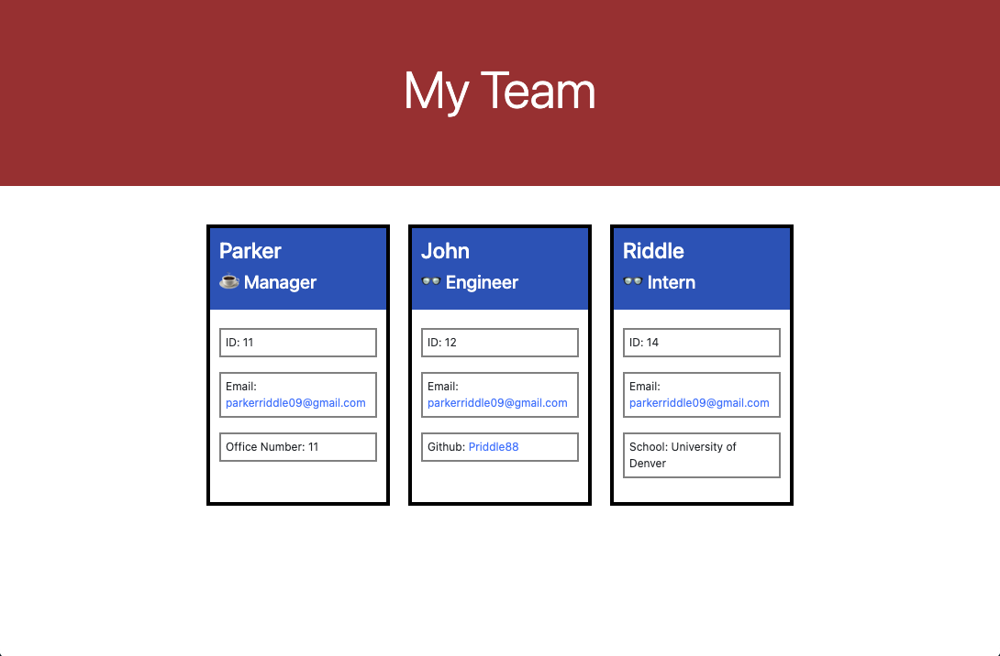

# Work profile Generator

## Description

I used node to create an HTML for a workplace. It uses input from the user to fill out the page. The program starts with the manager's information and then continues with the rest of the team.

## Table of Contents

- [Installation](#installation)
- [Usage](#usage)
- [Credits](#credits)
- [License](#license)

## Installation

Install inquirer and jest. Make sure that they are up to date by running npm i

## Usage

Run the program by typing npm run or node index.js in the console of the program. Type the answers until you are done completing your team.

[Screen recording of using file](https://drive.google.com/file/d/1o47OHkIOLN6Gnb6gC3RG0nJDzbQt7Xyf/view?usp=sharing "Screen recording of using file")

## License

MIT

## Contributing

I used the MDN docs a ton for this project. I also used the node documentation including the inquirer docs as well.

## Tests

Type npm run test in the console to test the classes for the project

## Questions

GitHub username: Priddle88

GitHub profile: [Link to Profile](https://github.com/Priddle88)

Reach out to parkerriddle09@gmail.com (with your first name included) if you have any questions!